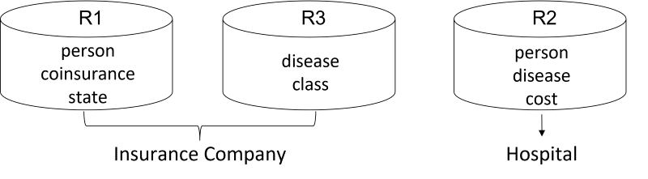
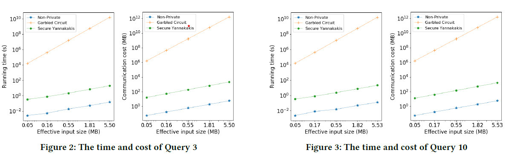

# SECYAN: An implementation to Secure Yannakakis 
--------------------------------------------------------------------------------

Yilei Wang and Ke Yi. [Secure Yannakakis: Join-Aggregate Queries over Private Data](https://www.cse.ust.hk/~yike/SecureYannakakis.pdf) ACM SIGMOD International Conference on Management of Data (SIGMOD), June 2021.

# What is “Secure Yannakakis”?
"Secure" refers to the [secure multi-party computation model (MPC)](https://en.wikipedia.org/wiki/Secure_multi-party_computation). 

"Yannakakis" refers to the generalized Yannakakis algorithm that computes any free-connex join aggregate query in linear time. 

Secure Yannakakis is a protocol that achieves the generalized Yannakakis algorithm under MPC model. 

# When do we need Secure Yannakakis?
Let's consider an example below. Suppose an insurance company have two tables that include the information of coinsurance of all the users and includes the classification of diseases respectively. On the other hand, a hospital holds a table that includes some information of the patients.

Now the insurance company wants to estimate the amount of payment classified by disease types, which can be expressed by a query. In the non-private model, hospital sends its table to insurance company, then the query can be computed by generalized Yannakakis algorithm. 
However under SMC model, this idea does not work, because we must ensure the privacy of the three tables. Using secure Yannakakis, after computation, the insurance company will learn the query results, but not the hospital’s data. The hospital should not learn anything about the insurance company’s data.

# Why do we choose Secure Yannakakis?
Just one reason: it is much faster than the best previous work, [SMCQL](https://arxiv.org/abs/1606.06808), that simply uses a Garbled Circuit.

# How to use SECYAN?
See [INSTALL.md](INSTALL.md) for configuration.

# Acknowledgment
Thank [@SixSiebenUno](https://github.com/SixSiebenUno) for helping writing the code.
